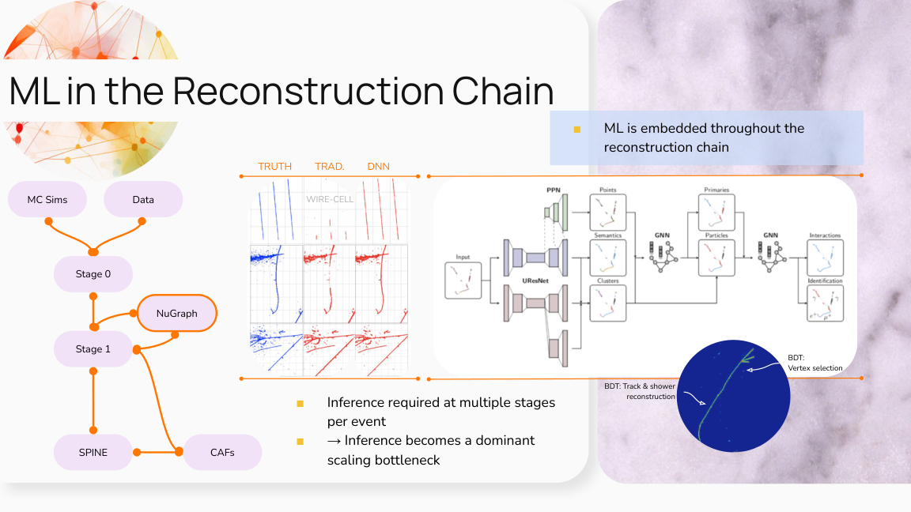
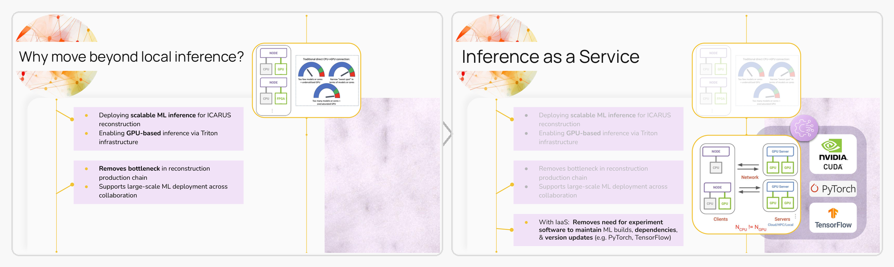
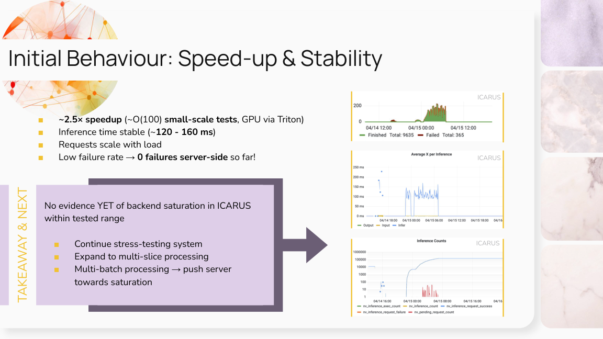

# ICARUS Inference as a Service Workflow

> As ML methods move deeper into the reconstruction chain, inference is no longer a small downstream detail: it becomes part of the production infrastructure. This repository records the ICARUS IaaS workflow developed around NuGraph2, with the aim of making the same pattern reusable for CVN and other inference-heavy reconstruction tasks.


---

## ⚠️ Work in Progress

This repository is a live technical handoff, not a frozen production manual. The NuGraph2 benchmark path is documented from local validation through EAF/grid submission and stress testing, while multi-slice and multi-batch extensions are still being tested. Treat commands as reproducible starting points, then check the latest commits and `WORKLOG.md` before launching large jobs.

> 📝 **Reference-path note:** paths under `/exp/icarus/app/users/sdey2/...` are provenance locations from the original NuGraph2 setup. They are useful places to inspect the benchmark files, but they should not be used as writable output areas by a new user. Runnable templates use placeholders such as `<USER>`, `<DEV_AREA>`, and `&user;`.

---

## Contents

- [Overview](#overview)
- [Required Access Before You Start](#required-access-before-you-start)
- [Workflow Snapshot](#workflow-snapshot)
- [Status At A Glance](#status-at-a-glance)
- [Repository Map](#repository-map)
- [Documentation Index](#documentation-index)
- [Quick Start](#quick-start)
- [What Is Reusable?](#what-is-reusable)
- [Known Working Benchmark](#known-working-benchmark)
- [Figures And Reference Slides](#figures-and-reference-slides)
- [Detailed Work Log And Acknowledgements](#detailed-work-log-and-acknowledgements)
- [Conventions](#conventions)

---

## Overview

This repository documents a reusable ICARUS workflow for deploying ML inference through Triton and the Elastic Analysis Facility (EAF). NuGraph2 is used as the benchmark implementation because it exercises the full chain: FHiCL configuration, Triton model access, EAF deployment, grid submission, diagnostics, and stress testing.

The broader aim is not to build a NuGraph-only handoff. The aim is to separate the infrastructure that should be reusable from the model-specific pieces that change between algorithms. CVN is included as one concrete adaptation example; the same pattern should apply wherever ML-based inference becomes a bottleneck in ICARUS or related reconstruction workflows, including DNN ROI, NuGraph, CVN, and future models.

---

## Workflow Snapshot



The core pattern is simple: keep the reconstruction job as the client, move the expensive model execution to a Triton server, and use EAF GPU resources when local CPU inference becomes the bottleneck.



---

## Status at a Glance

| Stage | Deployment Target | Purpose | Status |
|---|---|---|---|
| **(a)** | Local Triton on a GPVM | Validate client/server wiring; CPU-only sanity test | ✅ Working |
| **(b)** | Triton through EAF | GPU inference and grid-scale running | ✅ Working |
| **(c)** | NERSC and/or American Science Cloud | Cross-facility scaling path | ⏳ Not started |
| **Next** | Multi-slice / multi-batch | Increase request concurrency and push towards saturation | 🚧 Testing |
| **Next** | Stress testing | Map the stable-to-saturated transition | 🚧 In progress |

### ✅ Known Working Benchmark

The NuGraph2 Triton-via-EAF path has been demonstrated from small validation jobs through larger grid submissions. In the tested range, ICARUS remains in a stable operating regime: inference compute time stays around 120-160 ms, request counts scale with load, and there is no evidence yet of a runaway backlog.



---

## Repository Map

```text
icarus-iaas/
├── README.md                  <- orientation and contents
├── WORKLOG.md                 <- chronological record of what was tried
├── FILES_TO_ADD.md            <- status of real artefacts and deferred pieces
├── assets/                    <- small documentation figures extracted from slides
├── docs/                      <- ordered technical guides
│   ├── 00_before_you_start.md
│   ├── 00_concepts.md
│   ├── 01_environment_setup.md
│   ├── 02_pipeline_overview.md
│   ├── 03_local_triton.md
│   ├── 04_eaf_triton.md
│   ├── 05_grid_submission.md
│   ├── 06_stress_testing.md
│   ├── 07_troubleshooting.md
│   ├── 08_porting_a_new_model.md
│   ├── 09_grep_cheatsheet.md
│   ├── 10_job_submission_cheatsheet.md
│   └── 11_triton_eaf_minio_cheatsheet.md
├── fcl/
│   ├── nugraph/               <- real NuGraph benchmark FHiCL files
│   └── cvn/                   <- concrete example adaptation area
├── server/                    <- Triton launch scripts and model-repository notes
├── dictionaries/              <- ROOT dictionary changes for NuGraph products
├── grid/                      <- project.py XML and log extraction helper
├── analysis/                  <- plotting/log-scan notebook placeholders
└── scripts/                   <- small health-check helpers
```

---

## Documentation Index

| Document | Purpose |
|---|---|
| [`docs/00_before_you_start.md`](docs/00_before_you_start.md) | Account, permission, MinIO, EAF, Slack, and dashboard checklist before running anything |
| [`docs/00_concepts.md`](docs/00_concepts.md) | IaaS, Triton, gRPC, and why inference belongs in the production infrastructure |
| [`docs/01_environment_setup.md`](docs/01_environment_setup.md) | ICARUS account, GPVM/build-node, MRB, token, and disk-area setup |
| [`docs/02_pipeline_overview.md`](docs/02_pipeline_overview.md) | Stage0 -> Stage1 -> NuGraph -> CAF workflow and where ML plugs in |
| [`docs/03_local_triton.md`](docs/03_local_triton.md) | Local Triton validation on a GPVM; CPU-only but useful for wiring checks |
| [`docs/04_eaf_triton.md`](docs/04_eaf_triton.md) | Triton through EAF GPU infrastructure and server-side diagnostics |
| [`docs/05_grid_submission.md`](docs/05_grid_submission.md) | LArBatch/project.py grid submission workflow and log extraction |
| [`docs/06_stress_testing.md`](docs/06_stress_testing.md) | Scaling tests, queueing behaviour, dashboard interpretation, and MicroBooNE comparison |
| [`docs/07_troubleshooting.md`](docs/07_troubleshooting.md) | Error-code catalogue and high-value diagnostics |
| [`docs/08_porting_a_new_model.md`](docs/08_porting_a_new_model.md) | General adaptation guide, with CVN as one concrete example |
| [`docs/09_grep_cheatsheet.md`](docs/09_grep_cheatsheet.md) | Fast grep patterns for logs, FHiCL, and Triton output |
| [`docs/10_job_submission_cheatsheet.md`](docs/10_job_submission_cheatsheet.md) | Compact `project.py` and `jobsub` command reference |
| [`docs/11_triton_eaf_minio_cheatsheet.md`](docs/11_triton_eaf_minio_cheatsheet.md) | EAF, MinIO, Triton logs, model locations, and access notes |

---

## Required Access Before You Start

The full pre-flight checklist is in [`docs/00_before_you_start.md`](docs/00_before_you_start.md). The compact version is below.

### 1. Check Access

Before starting from scratch, make sure the access pieces are in place. A surprisingly large fraction of "software" failures in this workflow are really permission, token, or service-access failures.

| Access | Why It Matters | Where To Start |
|---|---|---|
| Fermilab services account | SSH, ServiceNow, tokens, dashboards | Fermilab account onboarding / Service Desk |
| ICARUS permissions | ICARUS GPVMs, `/exp/icarus/...`, `/pnfs/icarus/...`, software areas | Ask the ICARUS computing/software contacts for workspace and GPVM access |
| ICARUS GPVM access | Interactive setup, light tests, file inspection | `ssh -KXY <USER>@icarusgpvmNN.fnal.gov` |
| Build-node access | Larger local builds without overloading GPVMs | Use `icarusbuild02` for heavier `mrb` builds where possible |
| Bearer token / HTVault | Grid submission and protected data access | `htgettoken -a htvaultprod.fnal.gov -i icarus` |
| LArBatch / `project.py` | Grid submission through XML workflows | [SBN project.py guide](https://sbnsoftware.github.io/sbndcode_wiki/Using_projectpy_for_grid_jobs.html) |
| EAF access | Remote Triton inference on GPU infrastructure | [EAF IaaS documentation](https://eafdocs.fnal.gov/master/01_inference.html) |
| MinIO access | Inspecting/uploading Triton model repositories and configs | [MinIO login](https://minio-eaf.fnal.gov/login), request via [ServiceNow](https://fermi.servicenowservices.com/wp?id=evg-service-item&sys_id=2b7101261b58a950d03aec21f54bcb31) |
| Triton/FIFE dashboards | Monitoring jobs, queueing, requests, and server-side failures | [Triton logs](https://landscape.fnal.gov/monitor/d/mRzFgCySz/triton-logs?orgId=1), [Landscape dashboard](https://landscape.fnal.gov/monitor/goto/H9EJX6dDk?orgId=1), [FIFE batch dashboard](https://fifemon.fnal.gov/monitor/d/000000116/user-batch-details?orgId=1&var-cluster=fifebatch&from=now-15m&to=now) |

> ⚠️ **Access first, debugging second:** if a new user cannot see MinIO, cannot view the Triton logs, cannot write to the right ICARUS area, or cannot obtain a token, fix that before chasing FHiCL or C++ errors.

> 🧭 **People and channels:** for the general ICARUS IaaS workflow, useful contacts include Sparshita, Giuseppe, and Meghna. For Triton/EAF server-side information, Burt Holzman can help. New users should also join the FNAL Computing Slack; ask Giuseppe to add them if needed.

For large rebuilds, use `icarusbuild02` rather than a GPVM where possible. The build node has more resources, so `mrb i -j20` is reasonable there; on a GPVM, use something smaller such as `mrb i -j4`.

## Quick Start

### 2. Follow the Path

| If You Want To... | Start Here |
|---|---|
| Understand the architecture | `docs/00_concepts.md` |
| Build or re-enter the ICARUS dev area | `docs/01_environment_setup.md` |
| Reproduce the NuGraph benchmark | `docs/01` -> `docs/03` -> `docs/04` with `fcl/nugraph/` |
| Submit jobs through the grid | `docs/05_grid_submission.md` and `grid/` |
| Diagnose failures | `docs/07_troubleshooting.md` plus `docs/09_grep_cheatsheet.md` |
| Adapt the pattern to another model | `docs/08_porting_a_new_model.md` |

---

## What Is Reusable?

The reusable part is the scaffolding: environment setup, Triton connection, EAF deployment, grid submission, monitoring, log extraction, and stress-test methodology.

The model-specific part is deliberately small and visible:

| Component | Reusable Infrastructure | Model-Specific Surface |
|---|---|---|
| FHiCL | Same client/server pattern | Producer labels, model name, tensor names, product labels |
| Triton | Same model repository pattern | `config.pbtxt`, backend, `model.py` / `model.pt`, input/output tensors |
| Grid | Same `project.py` / XML strategy | Target FHiCL, file lists, resource requests |
| Diagnostics | Same logs, metrics, dashboards | Expected products and failure signatures |
| Dictionaries | Same method | The missing product classes differ by model |

CVN is included as a concrete adaptation example, not as the only intended endpoint. The organising principle is broader: once inference becomes a production bottleneck, the same IaaS pattern can be tested, monitored, and scaled.

---

## Figures and Reference Slides

The `assets/` folder contains small documentation figures extracted from Sparshita's ICARUS NuGraph2/IaaS slides:

- `assets/nugraph_reconstruction_chain.png` -- where NuGraph2 sits in the reconstruction chain.
- `assets/iaas_nugraph_slide_strip.png` -- the transition from local inference to Triton/EAF IaaS, shown as a two-slide strip.
- `assets/stress_test_summary.png` -- stable ICARUS NuGraph2 stress-test behaviour.
- `assets/queueing_regime.png` -- onset of queueing at higher load.
- `assets/edge_effect_timing_memory.png` -- timing and memory edge-effect diagnostic plot.

> 📝 External/reference slide decks are linked or cited in the notes where useful, but are not embedded as image assets unless they are part of this ICARUS NuGraph2 workflow material.

---

## Detailed Work Log And Acknowledgements

A more detailed chronological work log is available here:

- [Detailed NuGraph/IaaS setup log](https://docs.google.com/document/d/1qyF87ECWyGI3lJy5Wjoq8Hrr3RefnoGOLZa6wySlyGs/edit?tab=t.0)

This repository is based on the NuGraph/IaaS workflow developed and tested by Sparshita Dey. The linked log preserves the longer setup trail behind the cleaned workflow documented here.

> 🙏 **Acknowledgements:** special thanks to Meghna and Giuseppe for useful guidance and discussions during the development of this workflow.

---

## Conventions

- Working area on disk: `/exp/icarus/app/users/<USER>/`.
- Do **not** run large jobs in `/nashome`.
- Main NuGraph benchmark platform: `icaruscode v10_06_00_01p01`, branch `feature/rtriozzi_cerati_NuGraph2_Filter`, qualifier `e26:prof`.
- Triton model name for the benchmark: `nugraph2_icarus_mpvmprbnb`.
- `TODO[CVN]` marks a concrete CVN adaptation point, not the whole purpose of the repository.
- `grid/extractLogs.sh` refuses to run while `BASE` still says `CHANGEME`.

---

## What Is Real Vs Still to Come

| Status | Item |
|---|---|
| ✅ In repo | Six NuGraph FHiCL files, Triton launch scripts, dictionary additions, grid XML, log-extraction helper |
| ⏳ On MinIO | Real `config.pbtxt` and `model.py` for `triton-models/nugraph2_icarus_mpvmprbnb` |
| 🚧 Testing | Multi-slice and multi-batch path |
| ⏳ To add | Plotting notebooks and large-scale log-scan notebooks |

