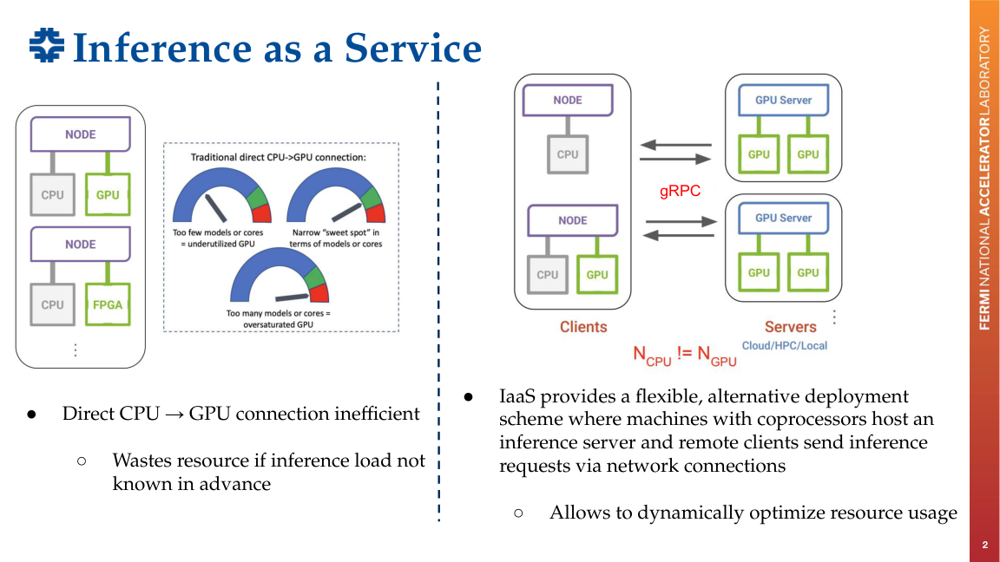

# 00 -- Concepts and Motivation

> A compact map of the IaaS idea: why inference moves out of the reconstruction process, what Triton provides, and how the request path is monitored.

---



## Why IaaS at All

In the traditional setup, a reconstruction job runs its ML model **in-process** on
the same node, talking directly to a local GPU (or, worse, the CPU). That couples
the experiment software to a specific ML stack (PyTorch/TensorFlow versions, CUDA,
etc.) and wastes hardware: you can't right-size GPUs to a load you don't know in
advance.

**Inference as a Service (IaaS)** flips this: machines with accelerators host an
**inference server**, and reconstruction jobs are thin **clients** that send
inference requests over the network. Benefits:

- **Decouples** the LArSoft reconstruction framework from any specific ML software --
  the experiment software no longer maintains ML builds, dependencies, or version updates.
- **Dynamically optimises resource usage** -- `N_CPU` clients need not equal `N_GPU`
  servers; many CPU jobs can share a few GPUs.
- **Scales** across facilities (local -> EAF -> NERSC / cloud) without changing the
  physics code.

Why this matters for ICARUS specifically: ML inference is embedded throughout the
reconstruction chain (DNN ROI in signal processing, NuGraph after Pandora, SPINE,
BDTs) and is the **dominant scaling bottleneck** -- full-chain production can take
O(months). Speeding up inference is the highest-leverage place to work.

## The Pieces

- **Triton inference server** -- NVIDIA's server that hosts one or more models and
  answers inference requests. Each model lives in a `model_repository` with a
  versioned dir and a `config.pbtxt` describing its input/output tensors.
- **NuSonic** -- the LArSoft/art-side client integration that lets a reconstruction
  module send its tensors to Triton instead of running the model locally. ("Sonic"
  = Services for Optimized Network Inference on Coprocessors.)
- **gRPC** -- the binary RPC protocol used for the actual inference traffic (port
  8001). Efficient, strongly typed, supports batching/streaming. Production C++
  Triton clients use gRPC.
- **HTTP/REST** (port 8000) -- easy-to-poke interface, great for health checks and
  validation; not the high-rate path.
- **Metrics** (port 8002) -- Prometheus-style metrics (request counts, durations,
  queue depth, GPU/CPU usage) scraped by Prometheus and visualised in Grafana.
- **Apptainer** -- container runtime that runs Triton inside a portable, SL7-compatible
  environment with the right python/CUDA/Triton backend bundled, isolated from the host.

## The Request Path

```
reconstruction job (client)
        │  API call over TCP (gRPC)
        ▼
   Triton server
        │  (running inside an Apptainer container)
        ▼
   model inference (on GPU, ideally)
```

## A Useful Comparator: DNN ROI for WCT (Wire-Cell Toolkit)

The same idea was applied to **DNN ROI finding** in the signal-processing chain
(U-ResNet architecture). There, the Triton client (`ITensorForward`) swaps in for
the local Torch service and:
1. configures the gRPC connection + model name and input/output names,
2. validates and flattens the incoming tensor,
3. calls `client->Infer(...)`,
4. wraps the returned bytes back into a WCT tensor,
5. has a **soft-fail** option (return a zero tensor instead of crashing) so the
   calling node can continue -- added to avoid seg faults during testing.

Reported result: **~65× faster** inference on an A100 (EAF) vs CPU, giving a 2-3×
overall workflow speedup (because DNN ROI was ~⅔ of total processing time). This is
the same pattern you're applying to NuGraph and CVN, just a different model and
client integration.
